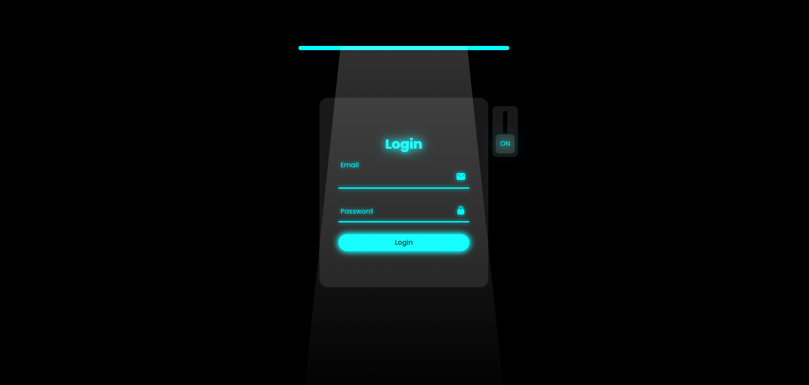

# Todo Junior - Простой список задач на React



## Описание

ростая форма входа, разработанная на React, с использованием стилей и иконок.

## Структура проекта

- **src/:** Исходный код React приложения.
- **index.css:** Основные стили приложения.
- **index.js:** Точка входа в React приложение.
- **App.js:** Компонент основного приложения.
- **public/:** Статические ресурсы, такие как HTML-файл и иконки.
- **package.json:** Файл конфигурации проекта.

## Запуск проекта

Для запуска проекта на своем компьютере выполните следующие шаги:

1. Склонируйте репозиторий на свой локальный компьютер:

   ```bash
   git clone git@github.com:myrzakan/auth-form.git

   ```

2. Перейдите в директорию проекта

   ```bash
   cd auth-form

   ```

3. Установите зависимости:

   ```bash
   npm install

   ```

4. Запустите проект:
   ```bash
   nmp start или yarn start
   ```
